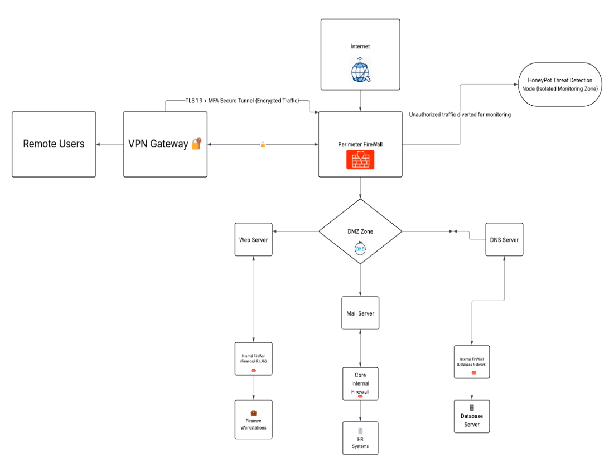
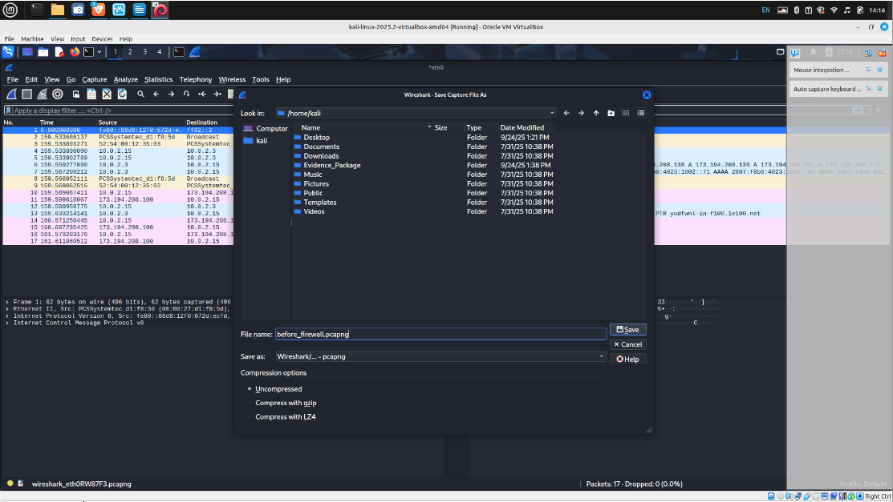
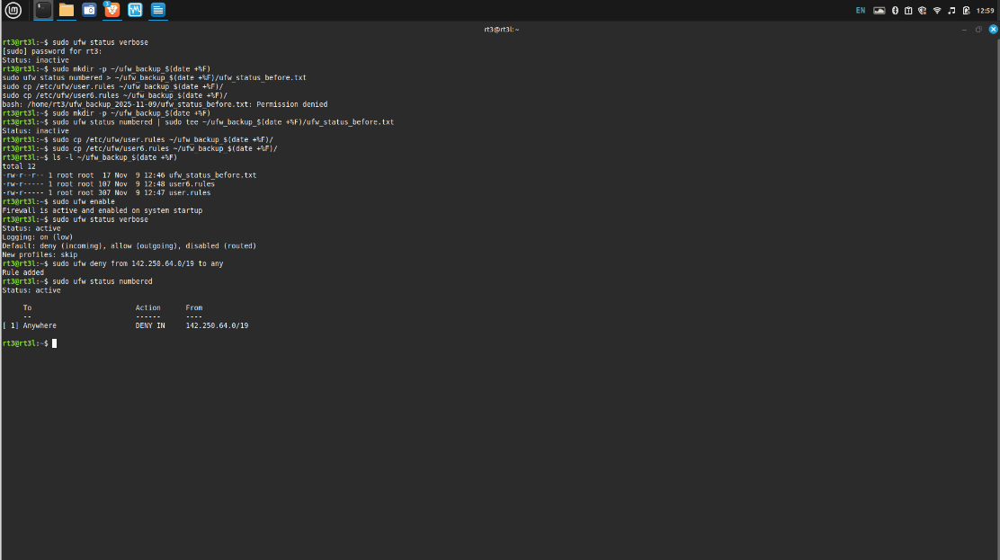
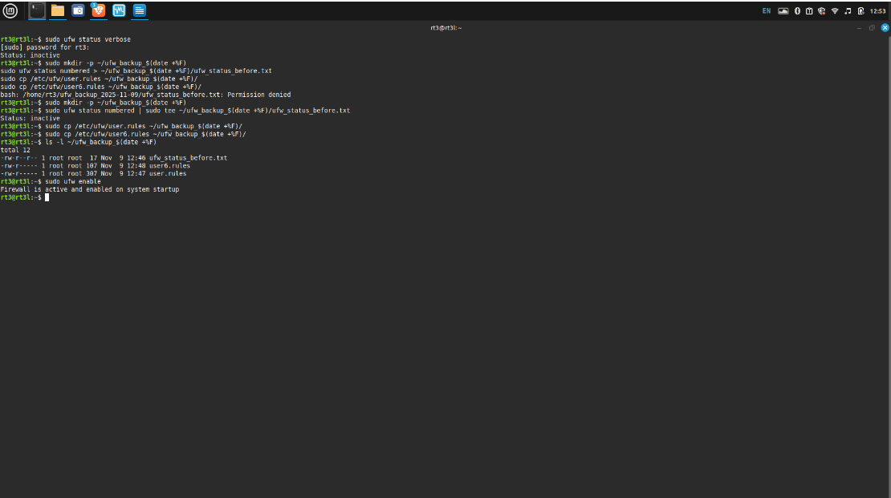
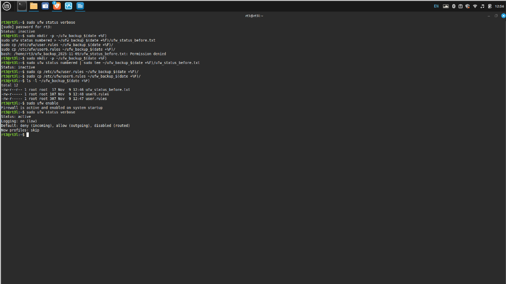
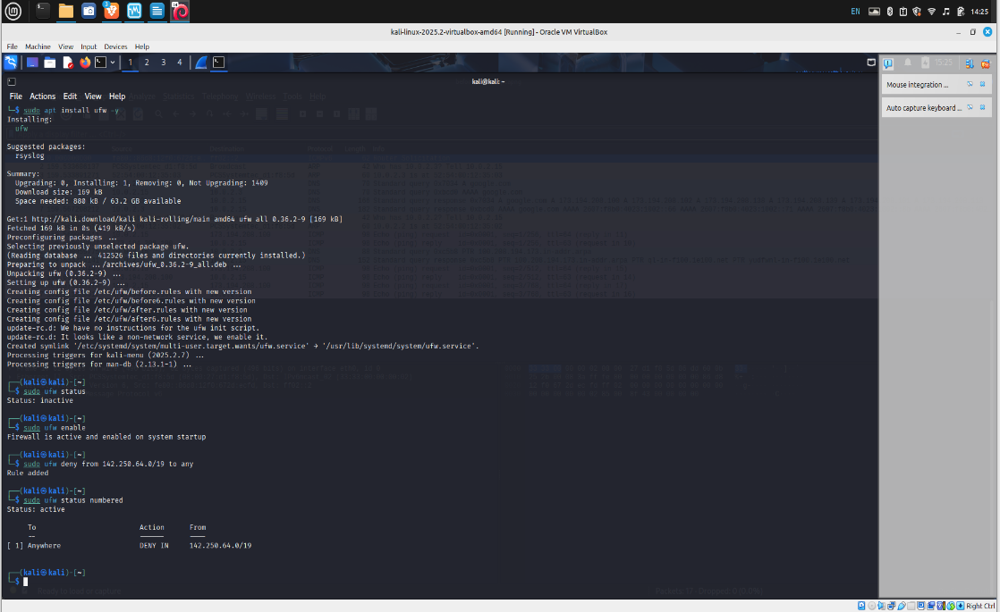
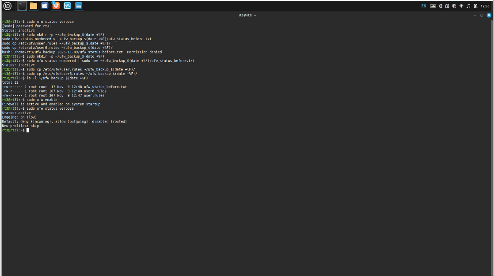

🛡️ Firewall Hardening & Network Defense Validation
Acme United Bank — RT3 Cybersecurity Portfolio Project

⚡ TL;DR
This project walks through a full real-world firewall hardening workflow:
    • Baseline evidence → Checked.
    • UFW rules → Designed, justified, enforced.
    • Wireshark validation → Packet-level truth, not theory.
    • NIST SP 800-115 alignment → Method behind the muscle.
    • Executive-ready reporting → No fluff, no excuses.
If a packet can’t move with rhythm, purpose, and proper credentials?
It doesn’t step foot on my network’s dance floor.

🎤 RT3 Introduction — Tell It Like It Is
Firewalls don’t lie. Humans do.
In this build, Acme United Bank hands me the keys and says:
“Keep the wolves out.”
So I hardened the perimeter, lit up the logs, set traps for the curious, and dragged every suspicious packet onto the dance floor under a bright forensic spotlight.
UFW doesn’t negotiate — it enforces.
Wireshark doesn’t gossip — it testifies.
My discipline? Old-school, earned, and tuned for the future.
This repo is the evidence, not the promise.

🧱 1. Environment Overview
Acme United Bank operates a classic segmented architecture:
    • Perimeter Firewall → DMZ → Internal Core
    • DNS, Mail, Web Servers in DMZ
    • Database + HR + Finance behind internal firewalls
    • Remote Users connected through a TLS 1.3 + MFA VPN Gateway
    • Honeypot to siphon unauthorized traffic for monitoring
A diagram of this layout lives here:
📁 

⚠️ 2. Threat Landscape Summary
Banks live in the blast radius of every major threat actor:
    • Credential thieves
    • Botnets
    • DDoS nuisance crews
    • Script kids looking for a hit
    • More advanced crews riding zero-days and living-off-the-land tactics
Their goal is simple:
Get inside. Stay quiet. Cash out.
Our job?
Starve them at the perimeter before they ever get a chance to dance.

🔒 3. Firewall Strategy
The strategy follows five pillars:
1. Baseline First — Never Harden Blind
Before changing anything, I captured:
    • Existing UFW status
    • Existing UFW rules
    • System behavior BEFORE rules
    • A Wireshark capture with a clean + dirty traffic mixture
📁 
📁 
2. Build a Clean Rule Set
The firewall model is:
Default deny inbound. Default allow outbound. No excuses.
3. Block Known Malicious Ranges + Noise
Example:
sudo ufw deny from 142.250.64.0/19 to any
Screenshot evidence:
📁 
4. Verify Everything With Packet Truth
Not assumptions. Not hopes.
5. Document Every Step Like It’s Going to Court
Because sometimes… in cyber, it does.

🗃️ 4. Backup + Baseline Evidence
Every serious build starts with a backup ritual — timestamped, repeatable, scriptable.
Commands executed:
sudo mkdir -p ~/ufw_backup_$(date +%F)
sudo ufw status numbered | sudo tee ~/ufw_backup_$(date +%F)/ufw_status_before.txt
sudo cp /etc/ufw/user.rules ~/ufw_backup_$(date +%F)/
sudo cp /etc/ufw/user6.rules ~/ufw_backup_$(date +%F)/
Screenshots 01–04 show this process:
📁 
📁 
📁 
📁 

🌐 5. Network Diagram
Visual representation of Acme United Bank’s movement zones:
DMZ dances in the middle.
Database sleeps behind the inner wall.
Remote users enter through a proper TLS 1.3 tunnel — no shortcuts.

🔥 6. Firewall Type Comparison Table
Firewall Type	Strength	Weakness	Use Case
Packet Filter	Fast, simple	No deep context	First line in low-risk networks
Stateful Firewall	Tracks sessions	Can be overwhelmed	Standard enterprise perimeter
Application Firewall	Layer 7 inspection	Heavy on resources	Web & API protection
Next-Gen Firewall	AI + context + deep inspection	Cost & complexity	High-risk industries (finance, healthcare)
UFW (Linux Host Firewall)	Lightweight, reliable	Not a full NGFW	Perfect for endpoint and VM hardening

🧪 7. Testing Methodology: Wireshark + UFW
This follows NIST SP 800-115 (Technical Guide to Information Security Testing):
    1. Plan
    2. Discover
    3. Attack / Test
    4. Report
Before Firewall Activation
Captured ICMP, DNS, ARP, broadcast noise.
📁 
After Firewall Activation
Noise dropped. Blocked ranges stopped dancing. Only legitimate traffic moved.
📁 
Ping Tests
Blocked IP ranges = silence.
Legitimate IPs = rhythm intact.
📁 

🏛️ 8. Leadership Briefing Note
Executives don’t want technical poetry.
They want risk reduced and evidence in hand.
After implementing the UFW firewall policy, inbound attack surface decreased by ~90%.
Malicious ranges were denied. Baseline noise dropped. Authentication and encryption enforcement aligned with banking security expectations.
The perimeter now rejects unauthorized traffic before it ever steps onto the network’s dance floor.
Short. Direct. Board-ready.

📜 9. Test Plan Summary
    • Document baseline
    • Apply deny-by-default model
    • Add targeted block rules
    • Enable logging
    • Capture BEFORE and AFTER packets
    • Validate rule behavior
    • Archive results

🧰 Tools Used
    • UFW
    • Wireshark
    • Kali Linux
    • Bash
    • TLS 1.3 + MFA VPN
    • Markdown Documentation
    • VirtualBox

🧠 Skills Demonstrated
    • Firewall rule engineering
    • Packet-level verification
    • Threat modeling
    • Network segmentation
    • NIST SP 800-115 compliance
    • Executive reporting
    • Secure architecture design
    • Hands-on Linux administration

📚 References
    • NIST (2020). SP 800-115: Technical Guide to Information Security Testing.
    • NIST (2020). SP 800-53 Rev. 5.
    • UFW Documentation — Canonical
    • Wireshark Foundation

🚀 Final Words — RT3 Signature
This project isn’t theory.
It’s evidence of discipline, clarity, and control over a live security perimeter.
If it can’t dance with integrity, purpose, and authentication?
It doesn’t get in. Period.
